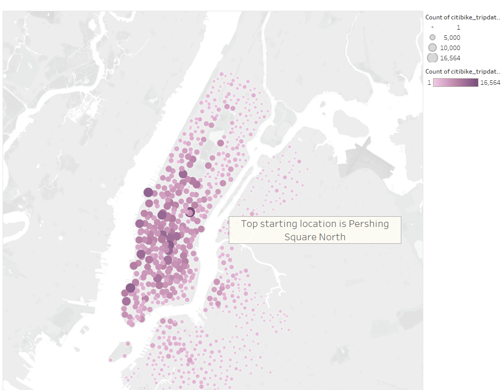

# Bike_Sharing

## Overview
We were tasked with analyzing and creating a visualization of the bike sharing data provided by Citi Bike. The analysis will provide an overall picture on how to market bike sharing in the Des Moines area

## Analysis

[This link will take you to the full Tableau story](https://public.tableau.com/app/profile/john.allen6982/viz/Bike_Sharing_16710359722870/Bike_Sharing?publish=yes)

### Checkout Times for All Users

We took the analysis a bit further and decided to break it down by Gender. As you can see below Males tend to be the highest users of the program

### Checkout Times for users by Gender

### Trips by Gender (Weekday per Hour)

In the below graphic we see that the Trips by Weekday for Each Hour shows the peak times that users checked out bikes

### Trips by Weekday Per Hour

Lastly we provided some analysis on the peak start and end locations to better determine where people tended to check out bikes more often.

### Top starting and ending locations

## Summary

Based on the data provided it would seem that Males are the highest users of the bike sharing program with the peak hours being between 7am-9am and 5pm-7pm. This along with the data showing the top starting and ending locations to be deep within the city would suggest that most users are using these bikes to commute to and from work. A second point of analysis shows that Men are the highest subscribers to the program. 
